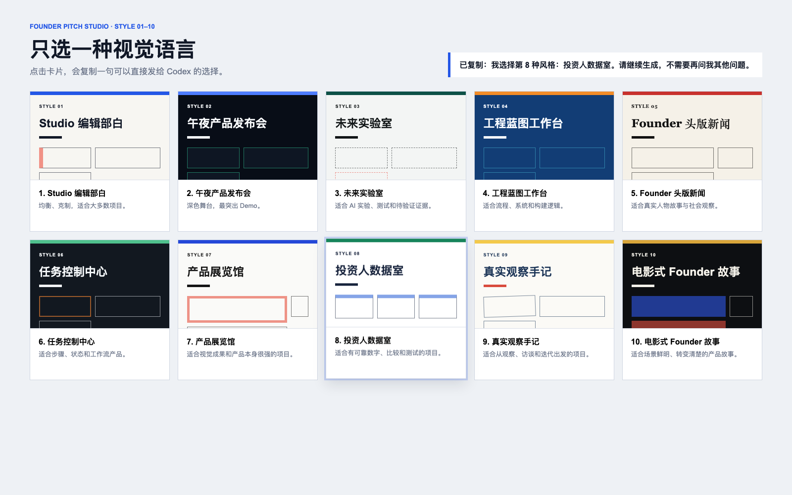

# Founder Pitch Studio Skill

把一个正在开发的项目自动整理成完整的 Founder Pitch 发布包。

它会读取项目中的文档、代码、测试、Bug、版本记录、截图和最近改动，然后连续完成：

1. 生成有证据标签的发布大纲；
2. 让 Founder 从 10 种视觉风格中选择 1 种；
3. 生成固定 16:9、可翻页、可投屏的 HTML；
4. 生成 5 分钟逐字稿、3 分钟精简稿、关键词提示卡和投资人 Q&A。

除选择视觉风格外，流程不会反复提问。资料不足时会标记 `[待验证]` 或 `[未完成]`，不会编造事实。



老师发布仓库、学生安装和课堂使用的完整步骤见
[老师发布与学生安装](docs/publish-and-install.md)。

## 安装

在 Codex 中输入：

```text
$skill-installer install https://github.com/narutopujian/founder-pitch-studio-skill/tree/main/skills/founder-pitch-studio
```

安装后重启 Codex。

## 使用

用 Codex 打开自己的项目文件夹，然后输入：

```text
$founder-pitch-studio 请读取我的项目，生成最终 Founder Pitch。
```

Skill 会在项目根目录生成 `founder-pitch-output/`。第一次运行时只需回复一个风格编号。

## 十种风格

1. Studio 编辑部白
2. 午夜产品发布会
3. 未来实验室
4. 工程蓝图工作台
5. Founder 头版新闻
6. 任务控制中心
7. 产品展览馆
8. 投资人数据室
9. 真实观察手记
10. 电影式 Founder 故事

视觉预览文件位于 `skills/founder-pitch-studio/assets/style-gallery.html`。
